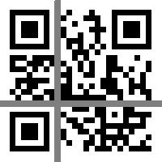

# ▼▼▼QRcode(?:450pts)▼▼▼　

Partially destroyed QR code was given as below

</img>

---

I used the following tool

`https://github.com/waidotto/strong-qr-decoder`

↓

Created below with `test.txt`

```
XXXXXXX_?_X___X___XXXXXXX
X_____X_?X___XXX__X_____X
X_XXX_X_?__X___X__X_XXX_X
X_XXX_X_?X____XXX_X_XXX_X
X_XXX_X_?X__X__X__X_XXX_X
X_____X_?_XXX__X__X_____X
XXXXXXX_?_X_X_X_X_XXXXXXX
________?__XXX_X_________
XXX_XXXX?__X_X___XX___X__
X__XXX_X?X__X_X__XX_____X
XXX_X_X_?_X_X_X__XXX_X__X
___X____?XX__XX__X__X__X_
_XXXXXX_?_X_____XXX__X_X_
_X_XX___?XX_X_X_XXX__XXX_
X_XX__XX?XX__X___XXX_X_XX
_X__XX_X?XXXXXXXX__X____X
?????????????????????????
________?__XXX_XX___XX___
XXXXXXX_?X_____XX_X_XXXXX
X_____X_?_XX_XX_X___X__X_
X_XXX_X_?__XX___XXXXXXXX_
X_XXX_X_?X__XX_XX__X_X___
X_XXX_X_?X____X_XXXXX___X
X_____X_?_X__XX_X_X_X__X_
XXXXXXX_?____X_XXX_X_XXXX
```

↓

$ python sqrd.py test.txt 

`SL7{AR_Code_rec0vEry_AsiEr}`

↓

As a result, submit did not indicate the correct flag

Even though it is `QR`, it seems that it is `AR` or wrong conversion

---

I filled up the data part of the QR code one character at a time and identified it

↓finally

```
xxxxxxx_?_x___x___xxxxxxx
x_____x_?x___xxx__x_____x
x_xxx_x_?__x___x__x_xxx_x
x_xxx_x_?x____xxx_x_xxx_x
x_xxx_x_?x__x__x__x_xxx_x
x_____x_?_xxx__x__x_____x
xxxxxxx_x_x_x_x_x_xxxxxxx
________?__xxx_x_________
xxx_xxxx?__x_x___xx___x__
x__xxx_x?x__x_x__xx_____x
xxx_x_x_?_x_x_x__xxx_x__x
___x____?xx__xx__x__x__x_
_xxxxxx_?_x_____xxx__x_x_
_x_xx___?xx_x_x_xxx__xxx_
x_xx__xx?xx__x___xxx_x_xx
_x__xx_x?xxxxxxxx__x____x
??????x????_x___xxxxxxx_x
________?__xxx_xx___xx___
xxxxxxx_?x_____xx_x_xxxxx
x_____x_?_xx_xx_x___x__x_
x_xxx_x_?__xx___xxxxxxxx_
x_xxx_x_?x__xx_xx__x_x___
x_xxx_x_?x____x_xxxxx___x
x_____x_?_x__xx_x_x_x__x_
xxxxxxx_?____x_xxx_x_xxxx
```

↓

$ python sqrd.py test.txt 

`SL7{QR_Code_rec0vEry_EAsiEr}`
