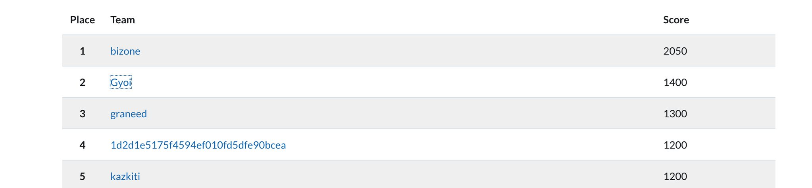

# ▼Break the Ice Challenges

By securelayer7 `https://twitter.com/securelayer7`

In Code blue 2018 `https://codeblue.jp/2018/contests/detail_05/`)

## Challenge list

### 【Web】

・Faster(100pts)　★I solved it.

    [writeup](https://github.com/kazkiti/CTF_writeup/blob/master/Break_the_Ice_Challenges-in_Code_blue_2018/faster(web:100pts).md)

・Force(100pts)

・Stellar collision(150pts)　★I solved it.

    [writeup](https://github.com/kazkiti/CTF_writeup/blob/master/Break_the_Ice_Challenges-in_Code_blue_2018/Stellar%20collision(web:150pts).md)

・Router(700pts)

### 【Forensic】

・KeyMontser(450pts)

・QRBeast(500pts)　★I solved it.

    [writeup](https://github.com/kazkiti/CTF_writeup/blob/master/Break_the_Ice_Challenges-in_Code_blue_2018/QRBeast(Forensic:500pts).md)

### 【IoT Challenge】

・Burn The Device(400pts)

### 【pwb】

・pwn1(350pts)　★I solved it.

### 【crypto】

・Tap(100pts)

・?(100pts)　★I solved it.

・?(?pts)

---

## Result
)
5th at 1200 pts

scoreboard of top 5 teams.

</img>
